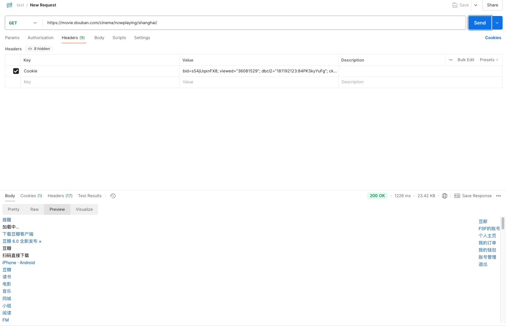

# 爬取豆瓣电影的top250

## 项目结构:
```
.
├── bin
├── cmd
│   └── main.go
├── config
│   ├── config.go
│   └── config.yml
├── doc
│   ├── README.md
│   ├── douban.html
│   └── pictures
│       ├── pic1.png
│       └── pic2.png
├── go.mod
├── go.sum
├── internal
│   ├── fetcher
│   │   └── fetcher.go
│   ├── file
│   │   └── write.go
│   └── parser
│       └── parser.go
├── logger
│   └── zap.go
└── model
    └── movie.go

12 directories, 14 files
```

## 项目运行
在项目根目录执行以下命令:
```
go run ./cmd/main.go
```

## 配置文件
[配置文件地址](../config/config.yml)

配置文件中的配置信息的默认值:
```yml
url: https://movie.douban.com/cinema/nowplaying/shanghai/ # 需要爬取的url
goroutines: 10 # 并发数量
outputPath: ./output # 输出文件路径
```

项目使用了[viper](https://github.com/spf13/viper)来读取配置文件

## 运行环境


## 解决过程

### 1. 查看豆瓣网页的结构

访问[该网页](https://movie.douban.com/cinema/nowplaying/shanghai/),使用POSTMAN 发送请求,发现返回 403 状态码,网页内容如下:

网页需要登录后才能访问

登录后通过浏览器控制台获取 Cookie


然后在 Postman 发送请求时请求头部带上刚刚获取到的 Cooike 进行测试


此时网页可以正常获取,然后将获取到的网页的HTML保存到[本地文件](./douban.html)中

此时分析该HTML文件,发现电影是这种格式:
```html
<li id="36154853" class="list-item" data-title="好东西" data-score="9.1" data-star="45"
    data-release="2024" data-duration="123分钟" data-region="中国大陆" data-director="邵艺辉"
    data-actors="宋佳 / 钟楚曦 / 曾慕梅" data-category="nowplaying" data-enough="True"
    data-showed="True" data-votecount="502558" data-subject="36154853">
    <ul class="">
        <li class="poster">
            <a href="https://movie.douban.com/subject/36154853/?from=playing_poster"
                class=ticket-btn target="_blank" data-psource="poster">
                
</a>
        </li>
        <li class="stitle">
            <a href="https://movie.douban.com/subject/36154853/?from=playing_poster"
                class="ticket-btn" target="_blank" title="好东西" data-psource="title">
                好东西
            </a>
        </li>


        <li class="srating">
            <span class="rating-star allstar45"></span>
            <span class="subject-rate">9.1</span>
        </li>
        <li class="sbtn">
            <a class="ticket-btn"
                href="https://movie.douban.com/ticket/redirect/?movie_id=36154853"
                target="_blank">
                选座购票
            </a>
        </li>
    </ul>
</li>
```

因此我们只需要寻找`class="list-item"`以及`class="list-item-hidden"`的即可

在此,使用了[goquery](https://github.com/PuerkitoBio/goquery)来解析HTML文件

项目会爬取电影信息,并且保存到csv文件中,默认保存位置为`output/movie.csv`中,文件内容大致如下:
```csv
标题,评分,年份,时长,地区,导演,演员,类型,海报url,电影页面url
好东西,9.1,2024,123分钟,中国大陆,邵艺辉,宋佳 / 钟楚曦 / 曾慕梅,nowplaying,https://img2.doubanio.com/view/photo/s_ratio_poster/public/p2915454411.jpg,https://movie.douban.com/subject/36154853/?from=playing_poster
因果报应,8.6,2024,141分钟,印度,尼蒂兰·萨米纳坦,维杰·西图帕提 / 阿努拉格·卡施亚普 / 玛玛塔·莫汉达斯,nowplaying,https://img1.doubanio.com/view/photo/s_ratio_poster/public/p2915350868.jpg,https://movie.douban.com/subject/36934908/?from=playing_poster
完美的日子,8.5,2023,125分钟,日本 德国,维姆·文德斯,役所广司 / 柄本时生 / 中野有纱,nowplaying,https://img1.doubanio.com/view/photo/s_ratio_poster/public/p2914293980.jpg,https://movie.douban.com/subject/35902857/?from=playing_poster
```

此外,项目会爬取电影的海报以及电影的首页,会将这两个内容保存,默认保存位置为`./output/{电影名字}/海报.jpg`以及`./output/{电影名字}/详情页.html`

在保存这两个内容时,考虑到会读取多个图片,因此采用`goroutine + channel`来并发读取,此部分代码:
```go
func save(n int) {
	// 使用 n 个 goroutine 从 ch 中读取数据并保存图片和电影详情页
	for i := 0; i < n; i++ {
		go func() {
			for movie := range ch {
				// 这里使用匿名函数来保证每个goroutine在处理完一个电影后都能调用wg.Done()来通知主goroutine
				func() {
					defer wg.Done()
					err := os.Mkdir(fmt.Sprintf("output/%s", movie.Title), os.ModePerm)
					if err != nil {
						fmt.Println(err)
					}
					// 保存图片
					err = downloadImage(movie.PosterUrl, fmt.Sprintf("output/%s/海报.jpg", movie.Title))
					if err != nil {
						fmt.Println(err)
					}

					// 保存电影详情页
					err = saveMoviePage(movie.MoviePageUrl, fmt.Sprintf("output/%s/详情页.html", movie.Title))
					if err != nil {
						fmt.Println(err)
					}
				}()
			}
		}()
	}
}
```

需要在每次从channel中读取一个电影后,在匿名函数中执行`defer wg.Done()`,否则`defer wg.Done()`会在该函数结束时才会被调用,不符合本意